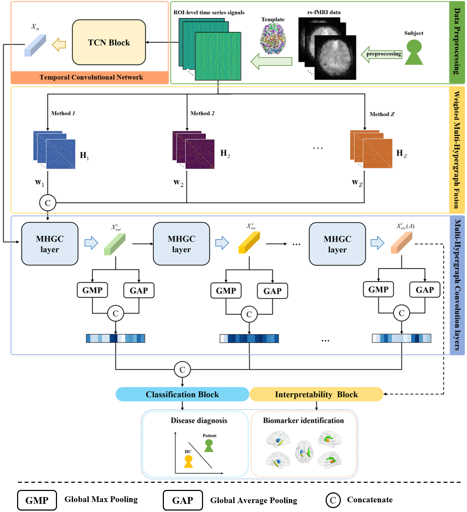

# STMHGN

## Overview
STMHGN: A Spatial-Temporal Muti-Hypergraph Network for Psychiatric Diseases Diagnosis and Biomarkers Identification.


## Python dependencies
The main packages used by this repository are:
* __python__==3.8
* __networkx__==3.1
* __pandas__==2.0.3
* __pytorch__==1.13.1
* __scikit-learn__==1.3.1
* __scipy__==1.10.1
* __torch-geometric__==2.2.0

## Repository structure
The repository is primarily composed of the following sections:
 * `STMHGN.py`: The core code of the proposed STMHGN model is primarily based on the `TCN` and `HGNN` modules.
 * `model_train.py`: The code for training and testing the model can be executed through the following example:
```pthon
    python model_train.py --dataset_name ABIDE --data_root /path/datasets/ --save_path /path/saved_model/
    # For detailed parameters, please refer to config.py.
```
 * `TCN.py`: Temporal Convolutional Network, available from: https://github.com/locuslab/TCN/blob/master/TCN/tcn.py
 * `utils.py`: Simple implementations of certain functions.
 * `visualization.py`: The model result visualization methods include loss curves, ROC curves, T-SNE, and the Grad-CAM
 * `dataset_process.py`: The in-memory dataset implemented based on the `InMemoryDataset` class from `PyTorch Geometric`, including the `ABIDEDataset` and `SZDataset`.

## Data availability
[ABIDE-I dataset](http://preprocessed-connectomes-project.org/abide/) is a publicly available dataset.

The WCH SZ dataset cannot be publicly shared, which was collected from the West China Hospital of Sichuan University.

## Acknowledgements

We would like to express our gratitude to the developers and contributors of the following open-source resources:

- [spatio-temporal-brain](https://github.com/tjiagoM/spatio-temporal-brain)
- [DwHGCN](https://github.com/JunqiAug/DwHGCN)

Special thanks to the open-source community for their continuous contributions!

